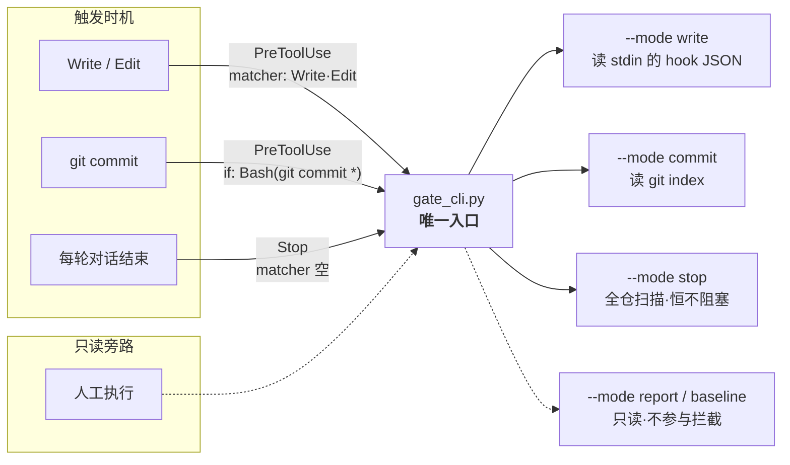
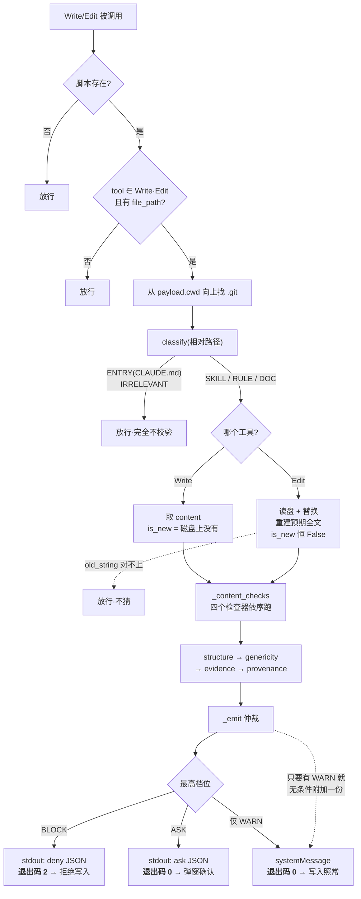
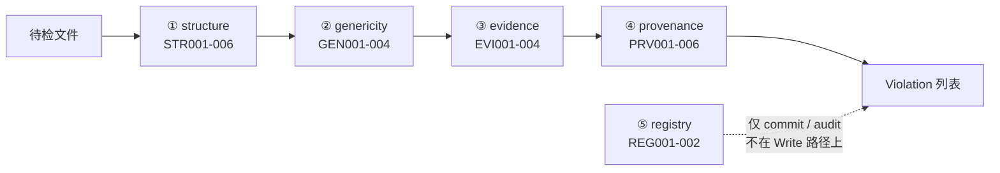
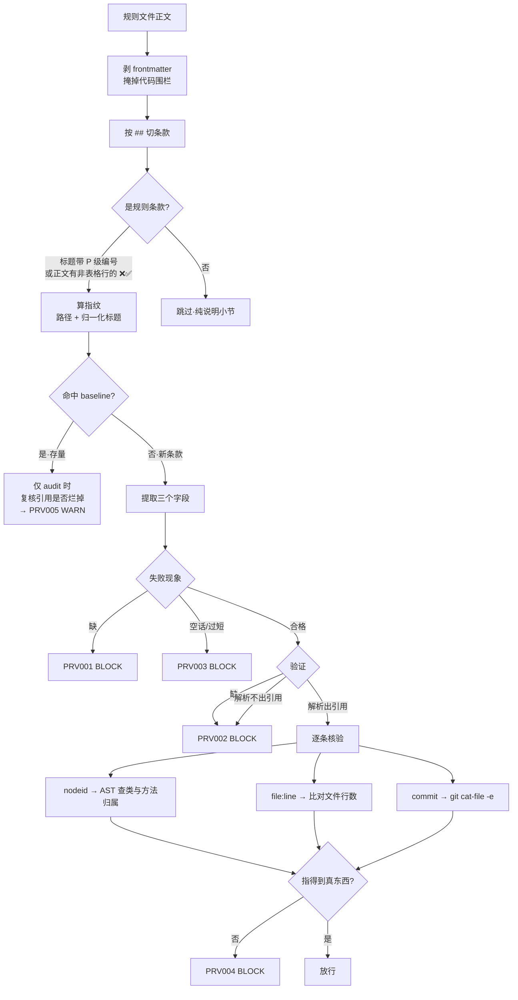
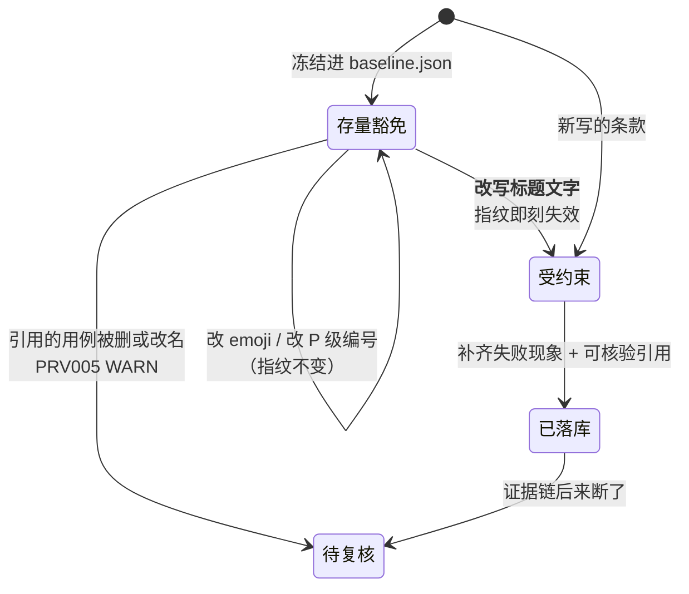
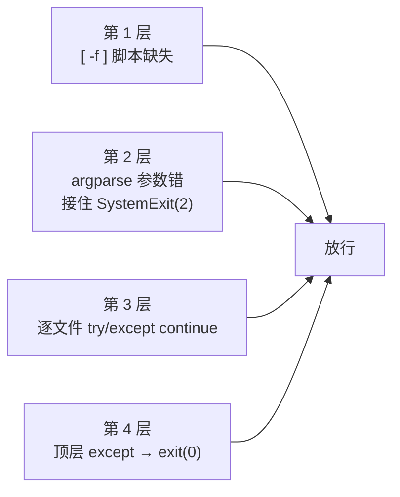

# 落库闸门机制

> 本文解释 `.claude/hooks/` 下这套校验器**为什么这样设计、实际怎么跑**。
> 规则条款本身（该写什么、违规码怎么修）在 [evolution-gate.md](../.claude/rules/agent-behavior/evolution-gate.md)，此处不重复。
> Mermaid 图在终端里不渲染，请用 VSCode 的 Markdown 预览（`Cmd+Shift+V`）或 GitHub 查看。

自我进化机制写入的内容会被**每个新会话当成高优先级上下文加载**。垃圾数据在这种架构里不是静态污染，而是会自我强化：写错一次，之后每次决策都被它带偏。闸门就是落库前的那道关。

---

## 一、接线拓扑：三个时机，一个入口

每条 hook 命令都以 `[ -f "$G" ] || exit 0` 开头。这不是泛泛的"防报错"：脚本缺失时 `python3` 会以退出码 2 结束，而 PreToolUse 的 2 意思是 **deny** —— 兜底写错方向的后果是**每一次 Write/Edit 都被拒**。

`--mode audit` 在 `main()` 里没有独立分支，它是函数末尾的兜底 `return`。`stop` 复用 audit 的扫描结果，但**无论多严重都返回 0**。

---

## 二、主干路径：一次 Write 从发起到落库

三个容易画错的地方：

- **ASK 的退出码是 0，不是 2。** 拦不拦由 stdout JSON 里的 `permissionDecision` 决定，退出码只区分「deny(2)」和「其余(0)」。
- **WARN 是并联的一路，不与 BLOCK/ASK 互斥。** 它在档位仲裁**之前**就被单独渲染，且不受仲裁过滤——否则同批混进 BLOCK 时 WARN 会被静默吞掉。它同时写 stderr 和 stdout 的 `systemMessage`：纯 WARN 走退出码 0，而宿主只从 stdout 取展示内容，不补这一份等于没写。
- **CLAUDE.md 完全不过内容校验。** 它是闸门的数据源（registry 从它读路由表），却不是检查对象。删掉路由表里一条 skill 链接，Write 当场不拦，要到 `git commit` 或 Stop 兜底才暴露。

---

## 三、五个维度：谁检查谁

| 维度 | 作用对象 | 管什么 |
|------|---------|--------|
| ① structure | skill · rule · doc | frontmatter、❌✅ 正反例、死链、行数上限 |
| ② genericity | skill · rule | 具体 URL、本地绝对路径、哈希类名、业务术语 |
| ③ evidence | rule（EVI001 含 skill） | 新建提案、`**触发**` 是否存在、标题查重 |
| ④ provenance | rule | 失败现象、可核验的验证引用、证据保鲜、孤儿 |
| ⑤ registry | 全局 | skill 是否在路由表注册、路由表死链 |

几个不对称之处，读代码时容易想当然：

- `docs/` 虽然进了内容校验，实际**只受 ① 的死链与行数约束**——②③④ 都只认 skill/rule。
- **③ 只验证据的壳，④ 才验瓤。** EVI002/EVI003 是纯形状检查，`**触发**：无` 完全合规；识破空话的是 PRV003。
- ② 的两级豁免在**同一个循环里**：先用窄豁免（仅 ❌/BAD/禁止 标记）查 GEN001/002，再用宽豁免（另含 `#` 标题、`|` 表格行、清单项）跳过 GEN003/004。画成"先判是否教学行→是则整行跳过"就错了——教学行仍要接受 URL 与绝对路径检查。
- ⑤ 在 commit 时还有条件：暂存清单里得有 `.claude/skills/` 下的文件或 `CLAUDE.md` 才跑。只改一个 rule 并提交，REG001 不会触发。

---

## 四、证据核验：这套机制的支点

形状检查挡不住编造——`**验证**：已验证过` 完全合规。所以证据必须**指向真实存在、可被机器核对的对象**。

要点：

- **nodeid 用 AST 静态解析**，不 import、不跑 pytest，无副作用且快。校验的是归属而不只是名字存在：`x.py::TestBeta::test_a` 在 `test_a` 其实属于 `TestAlpha` 时会被拒。基类定义在别的文件里时看不见继承来的方法，属于"问不出答案"，放行。
- **掩掉代码围栏是必需的**，而且两头都要防：围栏里的 `## ` 会切出幽灵条款（误拦），✅ 示例块里的 `**失败现象**` 会冒充真证据（漏判，直接架空本维度）。掩码而非删除，是为了让报出的行号仍对应原文件。
- **PRV005 有双重限定**：只对已豁免的存量条款、且只在 `audit=True` 时才跑。新条款的引用坏了走的是 PRV004 BLOCK。
- **PRV006 不受 `audit` 标志控制**，它由 `run_audit` 另行调用，所以 commit 模式永远不查孤儿。

---

## 五、存量基线：冻结而非回填

设计这套检查时，仓库里的条款绝大多数没写失败现象。强行回填只会逼人凭条款反推、编造一份看起来合规的假证据——与"真实有效"的目标正好相反。所以选择冻结。

指纹 = `sha1(文件路径 + 归一化标题)`，归一化时剔除 emoji、P 级编号与标点。**改写标题即视为改写规则本身**，须重新给证据——存量因此随日常维护自然收敛，不是永久豁免。

重新冻结需要 `--mode baseline --yes`。它等于批量豁免所有条款，**不要用它来绕过拦截**。

---

## 六、fail-open：宁可漏判，绝不阻塞

校验器自己出问题时一律放行。方向是刻意选的：闸门误拦会让自纠正的 agent 陷入"改了又被拦"的死循环，比漏判危险得多。

还有几处方向性的 fail-open，值得单独记住：

| 位置 | 问不出答案时 | 为什么是这个方向 |
|------|------------|----------------|
| `git_ignored()` | 返回 **True**（当作已忽略） | 两个调用方都把 False 读成"这是死链 → BLOCK"。返回 False 会凭空造出一条 BLOCK 去 deny `git commit` |
| Edit 的 `old_string` 对不上 | 返回空列表 | 重建不出预期全文就不猜 |
| AST 解析失败 | 不判 | 源码有语法错时无从核对 |
| `git cat-file` 不可用 | 当作存在 | git 环境问题不该变成证据造假的指控 |

**所以闸门没拦住不等于内容合格。** 脚本是兜底，规则本身仍须自觉遵守。

---

## 七、已知边界

诚实记录，避免下次重新踩：

- **Write/Edit 之外的写入不触发 PreToolUse。** Bash 的 `cat >`、`sed -i` 完全绕过，由 Stop hook 每轮兜回。Stop 只提示不阻塞——那里的退出码 2 意思是"阻止本轮停止"，与 PreToolUse 的 deny 相反，用错会把会话卡进停不下来的循环。
- **终端里手敲的 `git commit` 不过闸门**，仓库也没有 CI。`--mode commit` 只校验 index，`git commit -a` 捎带的未暂存改动从未被看过。
- **`if: "Bash(git commit *)"` 是前缀匹配**，`cd /x && git commit` 这类写法不以 `git commit` 开头，过滤不到。
- **commit 模式数据源是混的**：内容校验读 index（`git show :name`），同一次运行里的 registry 读的是工作区磁盘。
- **`docs/` 的扫描范围三模式不一致**：`classify` 认嵌套子目录，而 audit/stop 的 glob 是非递归的 `docs/*.md`。当前 `docs/` 下没有子目录，是潜在而非已发生的漏扫。
- **STR003 是文件级不是条款级**：整个文件里任意位置各有一个 ❌ 和一个 ✅ 就通过，不要求成对出现。
- **EVI001 只在"用 Write 创建磁盘上还不存在的文件"时出现**，Edit 路径写死 `is_new=False`。
- **索引文件豁免不一致**：`-index.md` / `-overview.md` 只在 STR003 与 provenance 被豁免，evidence 没有这层豁免。
- **围栏感知只有 provenance 做，evidence 与 structure 都不做**。所以写在代码围栏里演示的 `## P0.x`，会被 EVI003 当成条款（WARN），却不会被 provenance 当成条款。同一份文本在两个维度眼里是两个东西。
- **`git commit` 其实要过两道门**：`settings.json` 的 `permissions.ask` 里有 `Bash(git commit *)`，所以先有一次权限询问，再有闸门的 deny。这两条是并行的独立机制，不要当成一条链。
- **hook 超时后的行为无从查证**：write 10s / commit 20s / stop 15s，超时宿主当放行还是当失败，代码和文档里都没有依据——所以上面的图里没有「超时 → 放行」这条边。

---

相关：[evolution-gate.md](../.claude/rules/agent-behavior/evolution-gate.md)（规则条款与违规码速查） · [setup.md](./setup.md#落库闸门)（排障）
