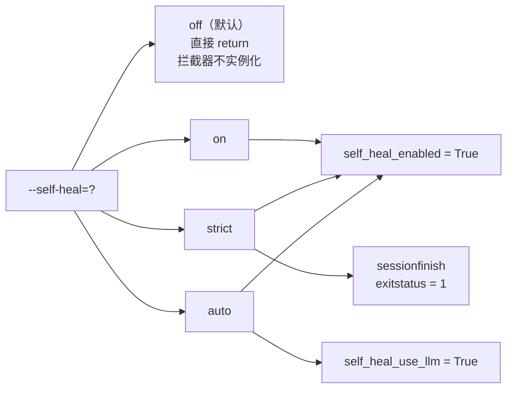
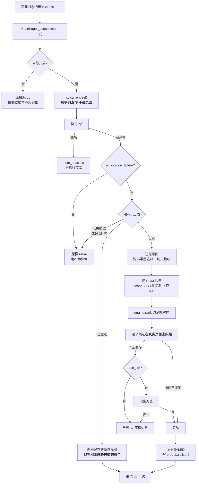
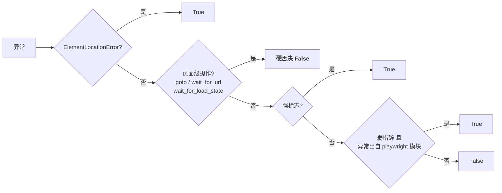
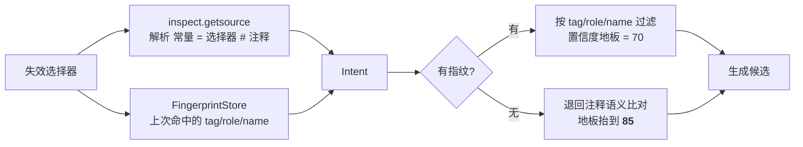
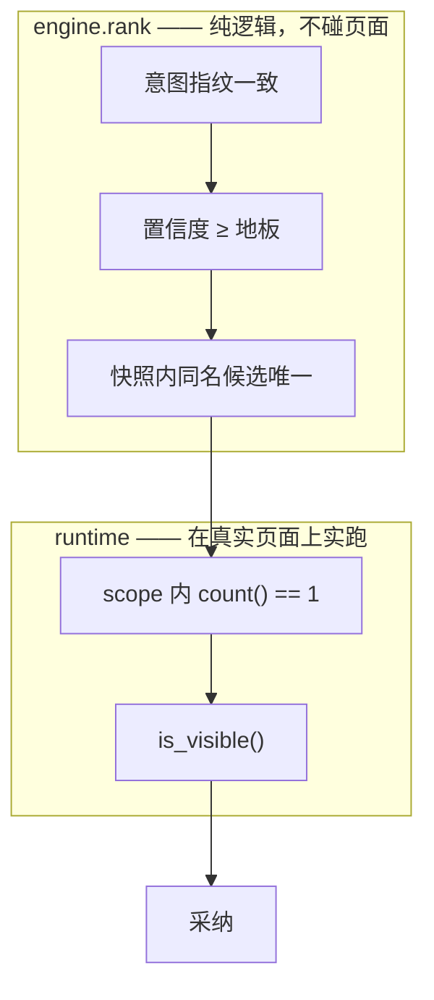
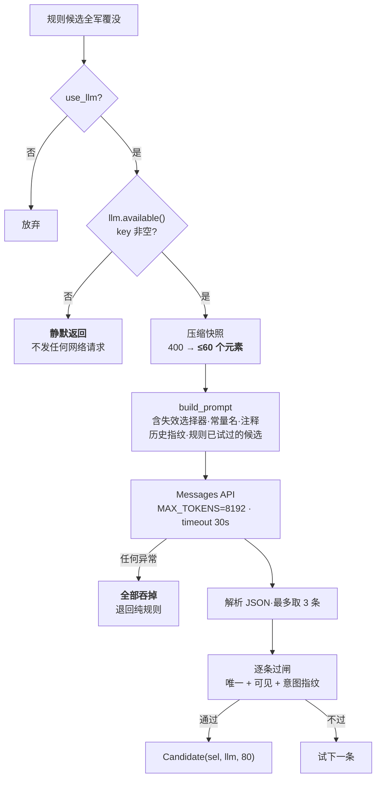
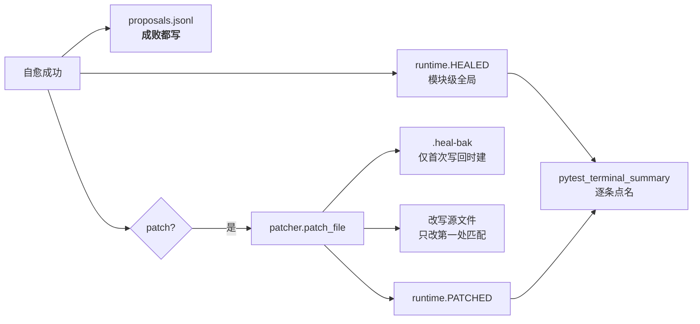

# 选择器自愈机制

> 本文解释 `framework/core/healing/` 这套自愈引擎**为什么这样设计、实际怎么跑**。
> 边界条款（什么能做、什么不许做）在 [self-healing-boundaries.md](../.claude/rules/playwright/self-healing-boundaries.md)，此处不重复。
> Mermaid 图在终端里不渲染，请用 VSCode 的 Markdown 预览（`Cmd+Shift+V`）或 GitHub 查看。

整套机制围绕一条安全不变量（[engine.py:9-12](../framework/core/healing/engine.py)）：

> 自愈只允许修复「定位」，绝不允许把真失败变成假通过。真正的危险不是修不好，而是候选匹配到了另一个恰好存在的元素——用例照样绿，功能其实已经坏了。**误报只是吵，假通过是骗。**

所有判定的保守方向都由这句话推出：拿不准就放弃自愈，让用例按原样失败。

---

## 一、四档开关：谁打开了什么

`auto` 相比 `on` 只多做一件事：规则交白卷时让模型推理（要 API key；没有 key 时等同 `on`）。**任何档位都不打开写回**：`BasePage.self_heal_patch` 默认 `False`，conftest 也不设置它 —— 运行期修好 ≠ 已入库，写回源码是 [selector-self-heal skill](../.claude/skills/selector-self-heal/) 的职责，且要经人确认与落库闸门（边界条款 P0.4）。

`strict` 在**运行期与 `on` 逐字相同**，不设任何额外属性；差别 100% 落在会话收尾把 `exitstatus` 置 1。而且那行只认字符串 `"strict"`——**`auto` 发生过自愈，仍以退出码 0 结束**。

---

## 二、主干路径：一次定位失败的完整旅程

**三个最容易画错的地方**：

- **没有任何「先探测选择器还有效吗」的前置节点。** `current()` 是纯字典查询，不碰页面。凭直觉多画一个前置校验框，恰恰是 P0.7 明令禁止的形态——`locator.count()` 不做自动等待，用它预探测会把「元素还没渲染」误判成「定位失效」，在半渲染页面上启动自愈。
- **自愈只挂在 `_act()` 这一条路径上。** 走 `_locate()` 的 `get_element_count` / `is_enabled` / `is_checked` / `wait_for_hydrated` 永不自愈；拿到 Locator 后自行 `.click()`，异常在方法之外抛出，自愈完全无法介入——这是一条静默盲区。
- **非定位失败原样抛出**，自愈层绝不吞异常。

另外三件容易想当然的事：

- **重试只有一次**，且第二次调用不在 `try` 内，异常直接向上传播。不是循环。
- **缓存命中那条边的终点不是成功**：已愈过的选择器再次失效时，`heal()` 第一行返回的正是刚刚失败的那个新值，拿它重试必然再失败。
- **`HEALED` 在重试之前就已写入**。所以终端汇总里有一条自愈记录，**不等于那个用例最终通过了**。
- **`MAX_ATTEMPTS = 25` 的作用域是单个 PageObject 实例**，不是单个选择器也不是全局；`_healed` / `_failed` / `_attempts` 随实例销毁归零，只有落盘的 `fingerprints.json` 跨实例存活。

### 定位失败的判定链（顺序敏感）

判定刻意偏保守（P0.9）：漏判的代价是用例照常失败，等于没有自愈，安全；误判的代价是在不该动的场景上启动自愈，可能把真失败变成假通过。两者不对等。

实测踩过两个坑：`page.goto` 的导航超时同样是 `TimeoutError`，「凡超时即定位失败」会在根本没加载出来的页面上启动自愈；一个写着 `no element matches the criteria` 的业务 `ValueError` 也会被纯文本匹配误判。

---

## 三、意图还原与候选生成

「意图」= PageObject 源码里的常量名 + 注释语义 + 上次成功命中时留下的指纹。

**证据越少，判定越严**：没有历史指纹时地板自动抬到 85，只接受强锚点。既无指纹又对不上注释说明，直接空池——没有任何依据认定它就是原来那个元素。

| 策略 | 置信度 | 说明 |
|------|--------|------|
| `testid` | 95 | 专用测试属性，最不易随样式改动失效 |
| `id` | 90 | 页面内唯一且语义稳定 |
| `role-name` | 85 | ARIA role + 可及名称，跟随语义而非样式 |
| `text` | 75 | 文案改动会失效，但语义直观 |
| `stable-class` | 60 | **在默认阈值下永远采纳不到**（60 < 地板 70） |

哈希类名（`css-1a2b3c` / `sc-bdVaJa` / `Button_a1b2c3`）在生成阶段就被剔除，判据与落库闸门的 GEN003 同源，且同样「宁可漏判」：误判为哈希只是少一个候选，误判为稳定则会拼出下次构建就失效的选择器，两种代价不对称。

---

## 四、三道闸与两段唯一性

**唯一性是两段，不是一段。** 快照层的去重只在「已按指纹过滤出的候选池内」统计同名选择器——它对池外元素是否也被该选择器命中一无所知。真正权威的判定是在真实页面上 `count()==1 && is_visible()`。画成单一闸门会丢掉「快照说唯一、页面上未必唯一」这一层。

唯一性判在 **scope 之内**：组件场景下 root 内唯一即可放行，不要求全页唯一。

**两条路径的闸序不同**，不能画成共用的同一串节点：

| | 规则路径 | 模型路径 |
|---|---|---|
| 意图指纹 | 在**元素筛选**阶段就用掉 | 实跑之后再用 `_element_of` 取实际命中元素补验 |
| 实跑时验什么 | 只验唯一 + 可见 | 唯一 + 可见 + 意图指纹 |

还有两处细节：**「匹配到 0 个」和「匹配到多个」在代码里是同一个分支**（`count() != 1`），没有区分处理也没有日志；**快照的过滤不是可见性过滤**——条件是宽与高**同时**为 0，`visibility:hidden`、`opacity:0`、被滚出视口的元素照样进快照，真正的可见性闸是 `is_visible()`。

---

## 五、模型兜底：什么时候出场，受什么约束

模型**只在规则交白卷后**出场——规则命中时模型根本不被调用。

`MAX_TOKENS=8192` 是实测值：会思考的模型把思考 token 也计入上限，实测某难例思考就花掉约 4500 token，上限给 1024/2048/4096 时 100% 落进「只有思考块、一个 text 块都没有」的截断，而截断与「模型正确地交白卷」在调用方看来完全一样。

**空候选有四种同形来源**，只有第三种会打 WARNING：

| 来源 | 有无线索 |
|------|---------|
| 没配 key | 无 |
| 网络 / 鉴权 / 超时失败 | 无 |
| 响应被 `max_tokens` 截断 | **WARNING 点名已用 token 与上限** |
| 模型正确地交白卷 | 无 |

还有一处静默截断：快照抓 400 个元素，送模型只有 60 个。正确元素若在 DOM 顺序上排第 61 位，模型永远看不到它，表现同样是「交白卷」。

---

## 六、产物与写回

- `HEALED` / `PATCHED` 是模块级全局 list，**是自愈层通向 pytest 报告层的唯一通道**，进程内不清空。
- `proposals.jsonl` **不是成功日志**：愈不成（`chosen=null`）也照写一条，它是「尝试记录」。产物落在 `reports/self-heal/`。
- 写回是框架**保留的能力**（上游 VelocitAI 的 patcher 原样存在，上图描述的仍是框架代码的事实），
  但本项目没有任何 `--self-heal` 档位会打开它：`BasePage.self_heal_patch` 默认 `False`，conftest 也不设置，
  实际运行里 `patch?` 分支永远走「否」。正式的写回路径是
  [selector-self-heal skill](../.claude/skills/selector-self-heal/)：人工复核 `proposals.jsonl` 里的提案后
  改文件，并过落库闸门（边界条款 P0.4：运行期绝不改写源码）。
- 写回被卡到极窄形态：常量名为空、为 `<unknown>`、或新旧值相同，三种情形直接否决；单行正则要求**常量名与旧值同时对上**，只改第一处，注释与行尾原样保留。
- 备份两个反直觉点：**只在第一次写回时建**（连续自愈两次后 `.heal-bak` 里是首次写回前那版，是设计不是 bug），且未发生实际改动时根本不建。
- **磁盘与内存在本次会话内是分叉的**：写回改的是磁盘文件，已 import 的 PageObject 类对象里常量还是旧值，本次运行继续靠拦截器的内存映射跑。

---

## 七、已知边界

- **`stable-class` 是条死策略**：置信度 60 低于默认地板 70，连候选列表都进不去。
- **`ElementLocationError` 分支从未被触发**：全仓没有任何地方 raise 它，是定义了却没人走的路。它还会跳过「页面级操作硬否决」，与条款描述的判定顺序相反。
- **模型候选不过哈希过滤，也不过置信度地板**：`_is_hashy` 全仓只在 `engine.py` 内被调用；模型候选的 `80` 是硬编码字面量，是标签不是判据。模型路径实际只受「唯一 + 可见 + 意图指纹」三道闸约束，哈希类名仅靠 prompt 里一句话劝阻。
- **配置缺失被当成「没配」而非错误**：新克隆的仓库里没有 `settings.py` 也能正常跑，只是自愈退回纯规则模式。
- **指纹库的键与取样源是两根不同的线**：`_healed` / `_failed` / `_attempts` 与指纹的键一律是**源码里那个原始选择器**，而指纹的取样用的是**本次实际生效的（可能已愈的）**选择器。
- **指纹库没有并发语义**：每个 PageObject 实例各建一个 store、各持一份构造时读入的内存副本，`put` 时整份覆盖写盘。同会话多实例时**后写覆盖先写**。画成单一共享组件会失真。
- **提案里的 `test_id` 恒为空串**：拦截器调 `attempt` 时不传它，只有单测会传。图上若画「提案带用例标识」即为错。
- **提案的下游读者是 agent 侧的 [selector-self-heal skill](../.claude/skills/selector-self-heal/)**，它靠 `chosen=null` 且候选为空来判定「元素真的不在了，是真缺陷」。只画到「写文件」就断了链。

---

相关：[self-healing-boundaries.md](../.claude/rules/playwright/self-healing-boundaries.md)（边界条款） ·
[selector-self-heal skill](../.claude/skills/selector-self-heal/)（复核与写回） ·
[gate-mechanism.md](./gate-mechanism.md)（落库闸门，另一套独立机制）
